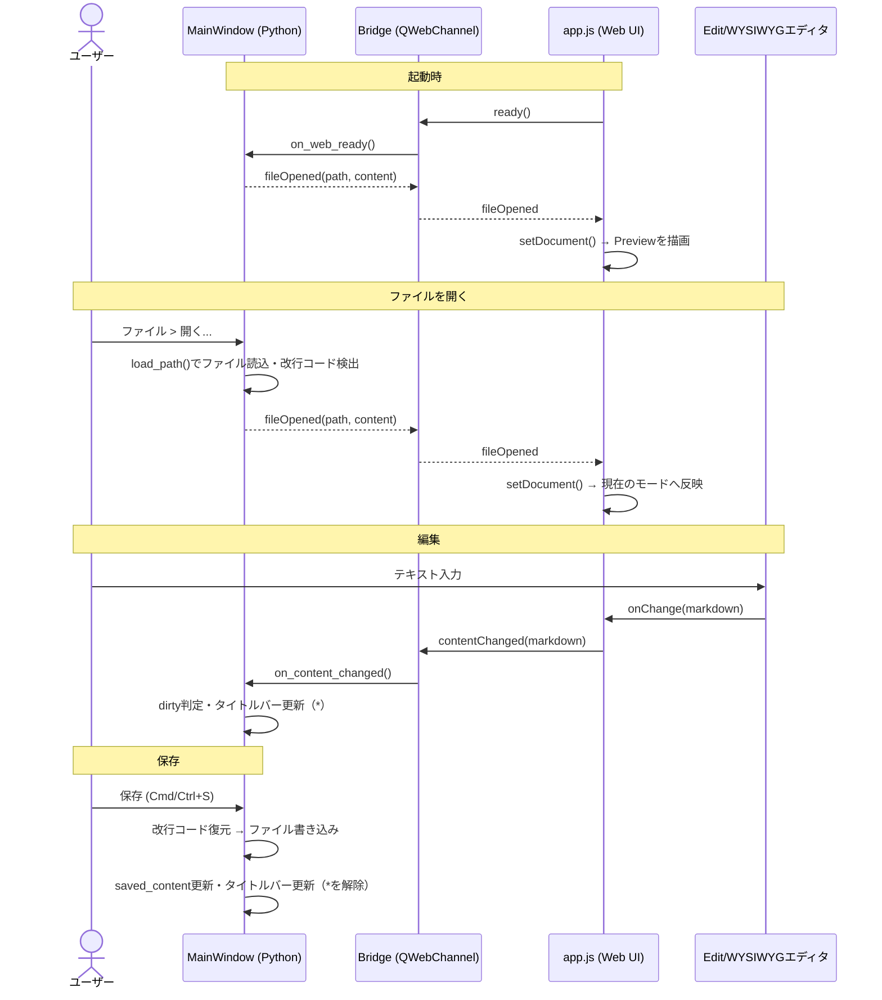

# Markdownエディタ 要件仕様書

## 1. 概要

macOSおよびWindowsで動作するクロスプラットフォームのMarkdownエディタを開発する。
GitHub Flavored Markdown (GFM) を基本記法とし、Mermaid記法による図表描画をサポートする。
Preview / WYSIWYG / Edit の3種類の表示モードを切り替えて利用できる。
OSSとして公開予定。

## 2. 対象プラットフォーム

* macOS

* Windows

* インストール不要でそのまま実行可能な形式（exe / .app）で配布する

* 配布チャネルは当面GitHub Releasesのみとする（パッケージマネージャ対応は将来検討）

## 3. 技術スタック

### 3.1 採用方針

WYSIWYG編集やMermaid描画はブラウザレンダリング（HTML/CSS/JS）を前提とする機能であり、
Tkinter等のPythonネイティブGUIのみでは実現が難しい。そのため以下のハイブリッド構成を採用する。

* **バックエンド／アプリシェル**: Python + [PySide6](https://doc.qt.io/qtforpython/) (Qt for Python)

  * ファイルの読み書き、OSネイティブなメニュー・ダイアログ、アプリのライフサイクル管理を担当

* **UI本体**: `QWebEngineView`（Chromiumベースの組み込みブラウザ）内で動作するHTML/CSS/JSアプリケーション

  * Preview / WYSIWYG / Edit 各モードの描画、Markdownパース、Mermaidレンダリングを担当

  * PythonとJS間は `QWebChannel` 等でブリッジし、ファイルI/Oや状態管理を連携する

  * ESM構成のライブラリ（CodeMirror 6 / Milkdown）は esbuild でバンドルし、成果物を `web/vendor/` に配置する

* **パッケージング**:

  * Windows: [PyInstaller](https://pyinstaller.org/) で単一exe化

  * macOS: PyInstaller または `py2app` で `.app` バンドル化

  * いずれもPython実行環境のインストールなしでそのまま起動できることを必須要件とする

### 3.2 主要ライブラリ（候補）

| 用途                  | 候補                                                                    | 備考                                               |
| ------------------- | --------------------------------------------------------------------- | ------------------------------------------------ |
| Markdownパース/レンダリング  | [markdown-it](https://github.com/markdown-it/markdown-it) + GFMプラグイン群 | Preview/Editのハイライト表示にも利用                         |
| WYSIWYGエディタ         | [Milkdown](https://milkdown.dev/)（ProseMirrorベース）                     | GFM・Mermaidのプラグインが公式/コミュニティで提供されておりOSS(MIT)。採用確定 |
| Editモードエディタ         | [CodeMirror 6](https://codemirror.net/)                               | Markdownシンタックスハイライト・日本語IME対応。OSS(MIT)。採用確定       |
| Mermaid描画           | [Mermaid.js](https://mermaid.js.org/)                                 | 公式JSライブラリをそのまま利用                                 |
| コードブロックのシンタックスハイライト | Shiki または highlight.js                                                | Edit/Previewモードで使用                               |
| PDF/HTMLエクスポート      | Chromiumの印刷機能 (`QWebEngineView` の `printToPdf`) / 静的HTML生成            | Mermaid図はレンダリング後の状態を書き出す                         |

技術選定は実装フェーズで詳細な比較検証（バンドルサイズ、ライセンス、保守状況）を行った上で確定する。

### 3.3 処理概要

　Python（アプリシェル）とJS（Web UI）間の主要なやり取りを以下に示す。
両者は `QWebChannel` の `bridge` オブジェクトを介して非同期にメッセージをやり取りし、
Markdown文字列を単一の真実の情報源として同期する（4章参照）。



## 4. 表示モード

3種類の表示モードをUI上のタブまたはボタンで切り替えられるようにする。

1. **Preview モード**: Markdownソースをレンダリングした読み取り専用表示
2. **WYSIWYG モード**: リッチテキストエディタとして直接編集し、内部的にMarkdownとして保存
3. **Edit モード**: Markdownソースをシンタックスハイライト付きのテキストとして直接編集

* モード切替時、カーソル位置やスクロール位置をできる限り保持する（初版はスクロール位置の近似維持のみとする）

* 各モード間でのデータの不整合が起きないよう、Markdown文字列を単一の真実の情報源（Single Source of Truth）として同期する

## 5. Markdown記法サポート

GitHub Flavored Markdown (GFM) を基本とし、以下を含む。

* 見出し、強調（太字/斜体/取り消し線）、リスト（順序/非順序/タスクリスト）

* テーブル

* コードブロック（言語指定によるシンタックスハイライト）

* リンク、画像、オートリンク

* 引用

* 水平線

* インラインHTML（必要最小限、XSS対策を考慮）

## 6. Mermaid対応

* ` ```mermaid ` コードブロックをMermaid.jsでレンダリングする

* フローチャート

  ```mermaid
  flowchart LR
      A[Markdown] --> B{モード}
      B --> C[Preview]
      B --> D[WYSIWYG]
      B --> E[Edit]
  ```

* シーケンス図

  ```mermaid
  sequenceDiagram
      participant U as ユーザー
      participant W as Webアプリ
      participant D as データベース

      U->>W: ログイン要求
      W->>D: ユーザー情報を検索
      D-->>W: ユーザー情報を返却
      W-->>U: ログイン成功
  ```

* Preview / WYSIWYG 両モードで図として表示する

* Edit モードではコードブロックとして表示する

* 対応する図の種類（フローチャート、シーケンス図等）はMermaid.jsが標準サポートするものに準拠する

## 7. エクスポート機能

* **PDFエクスポート**: 現在編集中のMarkdown（Mermaid図を含むレンダリング結果）をPDFファイルとして出力する

* **HTMLエクスポート**: レンダリング結果を単体で閲覧可能な静的HTMLファイルとして出力する

## 8. テーマ

* ライトテーマ / ダークテーマを切り替え可能とする

* OSのダーク/ライト設定に追従するオプションを提供する

## 9. ファイル操作（基本機能）

* Markdownファイル（.md）を開く / 保存 / 名前を付けて保存

* 新規作成

* 未保存変更のタイトルバー表示（\*マーク）と、未保存のまま閉じる／別ファイルを開く際の確認ダイアログ

* 改行コードの維持（CRLFのファイルはCRLFのまま保存する。内部処理はLFに正規化する）

* 最近使用したファイルの一覧表示

## 10. 検索機能（Previewモード）

Previewモードで表示中の文書に対するテキスト検索を提供する。

* **起動/終了**: Cmd/Ctrl+F で検索バーを表示する。Esc または閉じるボタンで終了し、ハイライトを解除する

* **インクリメンタル検索**: 入力の都度ヒット位置を更新する

* **ヒット表示**: 全ヒットをハイライトし、現在のヒットを強調表示する。ヒット件数と現在位置（例: 3/12）を表示する

* **移動**: Enter / Shift+Enter（または ↑↓ ボタン）で次/前のヒットへ移動し、該当位置へスクロールする

* **大文字小文字**: 区別しない（区別オプションは将来検討）

* **日本語対応**: 日本語を含むマルチバイト文字列を検索できること（検索バーはIME入力に対応する）

* **対象範囲**: レンダリング結果として表示されているテキスト（テーブル・コードブロック含む）

* **実装方式**: `QWebEnginePage.findText()`（Chromium組み込みの文書内検索）を利用し、検索バーはQt側のツールバーとして実装する。ハイライト・前後移動・件数取得はAPIの標準機能を用いる

* Edit / WYSIWYG モードでの検索、および置換機能は本項のスコープ外とする（12章参照）

## 11. 非機能要件

* 起動・保存・モード切替等の基本操作について体感速度を損なわないこと

* OSSとして公開することを前提に、採用ライブラリのライセンス（MIT/Apache-2.0等）に矛盾がないよう選定する

* 本アプリ自体のライセンスはMITとする（確定）

## 12. スコープ外・今後の検討事項

以下は今回のv1スコープには含めないが、将来的な拡張候補として記録する。

* ファイルツリー／フォルダ表示によるファイルナビゲーション

* タブによる複数ファイルの同時編集

* 自動保存

* 検索のEdit / WYSIWYGモード対応、および置換機能（Previewモードの検索は10章で対応）

* 印刷プレビュー

* 多言語対応（UIの日本語/英語切り替え等）

* 外部エディタとの連携（ファイル変更の自動検知・リロード）
