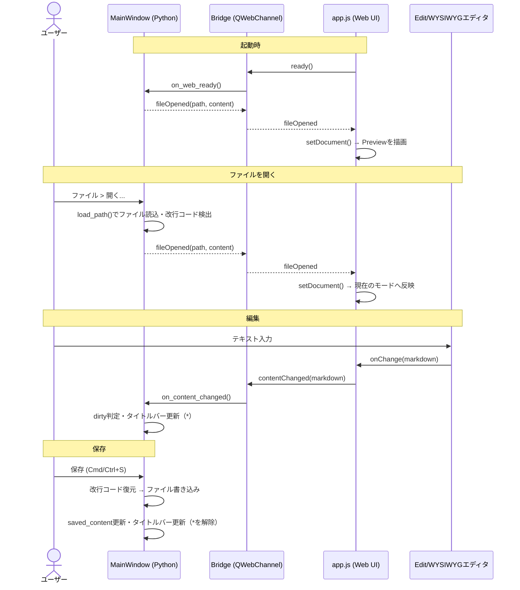

# Markdownエディタ 要件仕様書

## 1. 概要

macOSおよびWindowsで動作するクロスプラットフォームのMarkdownエディタを開発する。
GitHub Flavored Markdown (GFM) を基本記法とし、Mermaid記法による図表描画をサポートする。
Preview / WYSIWYG / Edit の3種類の表示モードを切り替えて利用できる。
OSSとして公開予定。

## 2. 対象プラットフォーム

* macOS

* Windows

* インストール不要でそのまま実行可能な形式（exe / .app）で配布する

* 配布チャネルは当面GitHub Releasesのみとする（パッケージマネージャ対応は将来検討）

## 3. 技術スタック

### 3.1 採用方針

WYSIWYG編集やMermaid描画はブラウザレンダリング（HTML/CSS/JS）を前提とする機能であり、
Tkinter等のPythonネイティブGUIのみでは実現が難しい。そのため以下のハイブリッド構成を採用する。

* **バックエンド／アプリシェル**: Python + [PySide6](https://doc.qt.io/qtforpython/) (Qt for Python)

  * ファイルの読み書き、OSネイティブなメニュー・ダイアログ、アプリのライフサイクル管理を担当

* **UI本体**: `QWebEngineView`（Chromiumベースの組み込みブラウザ）内で動作するHTML/CSS/JSアプリケーション

  * Preview / WYSIWYG / Edit 各モードの描画、Markdownパース、Mermaidレンダリングを担当

  * PythonとJS間は `QWebChannel` 等でブリッジし、ファイルI/Oや状態管理を連携する

  * ESM構成のライブラリ（CodeMirror 6 / Milkdown）は esbuild でバンドルし、成果物を `web/vendor/` に配置する

* **パッケージング**:

  * [PyInstaller](https://pyinstaller.org/) を採用し、`packaging/markdown_editor.spec` から macOS向け `.app` / Windows向け `.exe` を生成する（macOSは実装・動作確認済み。Windowsは同じspecファイルで生成できる見込みだが未検証）

  * いずれもPython実行環境のインストールなしでそのまま起動できることを必須要件とする（`web/` 一式をアプリ内に同梱し、QtWebEngineのフレームワーク/ヘルパープロセスもPyInstallerの標準フックで同梱される）

### 3.2 主要ライブラリ（候補）

| 用途                  | 候補                                                                    | 備考                                               |
| ------------------- | --------------------------------------------------------------------- | ------------------------------------------------ |
| Markdownパース/レンダリング  | [markdown-it](https://github.com/markdown-it/markdown-it) + GFMプラグイン群 | Preview/Editのハイライト表示にも利用                         |
| WYSIWYGエディタ         | [Milkdown](https://milkdown.dev/)（ProseMirrorベース）                     | GFM・Mermaidのプラグインが公式/コミュニティで提供されておりOSS(MIT)。採用確定 |
| Editモードエディタ         | [CodeMirror 6](https://codemirror.net/)                               | Markdownシンタックスハイライト・日本語IME対応。OSS(MIT)。採用確定       |
| Mermaid描画           | [Mermaid.js](https://mermaid.js.org/)                                 | 公式JSライブラリをそのまま利用                                 |
| コードブロックのシンタックスハイライト | Shiki または highlight.js                                                | Edit/Previewモードで使用                               |
| PDF/HTMLエクスポート      | Chromiumの印刷機能 (`QWebEngineView` の `printToPdf`) / 静的HTML生成            | Mermaid図はレンダリング後の状態を書き出す                         |

技術選定は実装フェーズで詳細な比較検証（バンドルサイズ、ライセンス、保守状況）を行った上で確定する。

### 3.3 処理概要

　Python（アプリシェル）とJS（Web UI）間の主要なやり取りを以下に示す。
両者は `QWebChannel` の `bridge` オブジェクトを介して非同期にメッセージをやり取りし、
Markdown文字列を単一の真実の情報源として同期する（4章参照）。



## 4. 表示モード

3種類の表示モードをUI上のタブまたはボタンで切り替えられるようにする。

1. **Preview モード**: Markdownソースをレンダリングした読み取り専用表示
2. **WYSIWYG モード**: リッチテキストエディタとして直接編集し、内部的にMarkdownとして保存
3. **Edit モード**: Markdownソースをシンタックスハイライト付きのテキストとして直接編集

* モード切替時、カーソル位置やスクロール位置をできる限り保持する（初版はスクロール位置の近似維持のみとする）

* 各モード間でのデータの不整合が起きないよう、Markdown文字列を単一の真実の情報源（Single Source of Truth）として同期する

## 5. Markdown記法サポート

GitHub Flavored Markdown (GFM) を基本とし、以下を含む。

* 見出し、強調（太字/斜体/取り消し線）、リスト（順序/非順序/タスクリスト）

* テーブル

* コードブロック（言語指定によるシンタックスハイライト）

* リンク、画像、オートリンク

* 引用

* 水平線

* インラインHTML（必要最小限、XSS対策を考慮）

### 5.1 右クリックメニューによる要素の挿入

WYSIWYG / Edit 両モードで、右クリックメニューから新規要素（テーブル・Mermaid図）を挿入できる。

* **起動方法**: 編集領域を右クリックするとカスタムメニューを表示する。ブラウザ標準の右クリックメニューは表示しない（コピー・貼り付けはキーボードショートカットで行う前提とする）

* **メニュー構成**: 「テーブル」（サブメニューでサイズ選択）・「フローチャート」・「シーケンス図」

* **テーブルの挿入**:

  * 「テーブル」にポインタを合わせると1階層奥のサブメニュー（グリッドピッカー）を表示する。最大10列×8行のマス目をマウスオーバーすると「3行×4列」のように選択中のサイズをハイライトとラベルで示し、クリックで確定して挿入する

  * 選択した行数にヘッダー行を含める（例: 3行×3列 → ヘッダー1行+データ2行）。GFMテーブルはヘッダー行が必須のため、1行のみ選択した場合はヘッダー1行+データ1行として挿入する

  * 全セル空のGFMテーブル（ヘッダー行+区切り行+データ行、列揃え指定なし）を挿入する

* **Mermaid図の挿入**: 「フローチャート」または「シーケンス図」を選択すると、既定テンプレート（フローチャート: ノード1個 / シーケンス図: 参加者2人とメッセージ1件）の ` ```mermaid ` ブロックを挿入する。挿入後の編集はWYSIWYGモードのGUIエディタ（6.1 / 6.2）またはEditモードのテキスト編集で行う

* **挿入位置**: カーソル位置（右クリックした位置）に挿入する。Editモードでは前後に空行を確保してブロックとして挿入する

* **キャンセル**: Escまたはメニュー外クリックでメニューを閉じる

* **スコープ**: 挿入後のテーブルの行・列の追加/削除は、WYSIWYGモードの既存テーブルツールバーで行う

### 5.2 クリップボード画像の貼り付け

WYSIWYG / Edit 両モードで、クリップボードに画像データがある状態で貼り付け（Cmd/Ctrl+V）を行うと、画像をファイルとして保存しMarkdownの画像リンクとして埋め込む。

* **対象モード**: WYSIWYG / Edit（Previewは読み取り専用のため対象外）

* **保存先**: 編集中の文書と同じフォルダ直下の `image` フォルダ（存在しなければ自動作成する）

* **ファイル名**: `image-YYYYMMDD-HHMMSS.png` のタイムスタンプ名。同名ファイルが存在する場合は `-2`、`-3`…の連番を付加して衝突を回避する。保存形式はPNG固定とする

* **埋め込み形式**: ``（文書からの相対パス）。WYSIWYGでは画像として表示されるノードを挿入し、Markdownへは同形式で書き出す

* **未保存の新規文書での貼り付け**: 保存先フォルダが未確定のため、「名前を付けて保存」ダイアログを自動で開く。保存が完了したら画像の保存と埋め込みを続行し、キャンセルされた場合は貼り付け全体を中止する

* **テキストと画像が両方ある場合**: テキストの貼り付けを優先する（表計算ソフトの表コピー等を壊さないため）。クリップボードが画像のみの場合に本機能が働く

* **相対パス画像の表示**: Preview / WYSIWYG 両モードで、文書フォルダを基準に相対パスを解決して画像を表示する。貼り付けた画像に限らず、既存文書に記述された相対パス画像も表示対象とする

* **孤児ファイル**: 画像は貼り付け時点で即座にディスクへ保存される。その後文書を保存せずに破棄した場合でも画像ファイルは削除しない（未使用画像のクリーンアップはv1ではスコープ外）

* **実装方式**: 貼り付けはWebビュー内のpasteイベントで検知し、画像データをBase64でQWebChannelブリッジ経由でPython側へ渡してファイル保存する。相対パスの解決には文書フォルダの情報を用い、レンダリング時に画像URLを文書基準へ書き換える

### 5.3 リンクのクリック挙動

Preview / WYSIWYG モードでMarkdown内のリンクをクリックした際、リンク先の種類に応じて遷移方法を振り分ける（現状は振り分けを行わず、アプリ内のWebビューがそのまま遷移してしまい、外部リンクをクリックすると編集画面が失われる問題があるため、これを解消する）。

* **相対パスの `.md` / `.markdown` ファイルへのリンク**: アプリ内でそのファイルを開く。現在の文書フォルダを基準にパスを解決し、既存の「ファイルを開く」と同様に未保存の変更があれば確認ダイアログを経由する

* **外部リンク（`http://` / `https://` 等）**: アプリ内では遷移せず、OS既定のブラウザで開く

* **その他の相対/絶対パスリンク（`.md` / `.markdown` 以外のファイル）**: OS既定のアプリケーションで開く（外部リンクと同様、アプリ内では遷移しない）

* **WYSIWYGでの修飾キー**: WYSIWYGは編集可能領域のため、単純クリックはリンクテキストの編集・カーソル移動に使えるようにし、Cmd/Ctrl+クリックのときのみ本挙動（振り分け）を発動する。Preview（読み取り専用）では修飾キー不要で単純クリックで発動する

* **実装方式**: Web側でリンクのクリックを検知し（`preventDefault`でページ内遷移を止める）、リンク先の生のhref文字列を `bridge` 経由でPython側へ渡して判定・実行する（`QDesktopServices.openUrl` によるOSへの委譲、または「アプリ内でファイルを開く」）。取り漏れた遷移が発生しないよう、`QWebEnginePage.acceptNavigationRequest`側でもリンククリックによるページ内遷移を安全網として抑止する

* **スコープ外**: 文書内アンカーリンク（`#見出し` 等によるスクロール）は現状スコープ外とする（見出しへのid付与を含め将来検討）

## 6. Mermaid対応

* ` ```mermaid ` コードブロックをMermaid.jsでレンダリングする

* フローチャート

  ```mermaid
  flowchart TB
      A["Markdown"]
      B{"モード"}
      C["Preview"]
      D["WYSIWYG"]
      E["Edit"]
      n1["marmeidエディタ"]
      n2("ズーム機能")
      n3["編集"]
      n4(["検索機能"])
      n5{"条件式"}
      n6["新規ノード"]
      n7["新規ノード"]
      A --> B
      B --> C
      B --> D
      B --> E
      D -.-> n1
      n1 --> n2
      n1 -.-> n3
      C --> n4
      E --> n5
      n5 -->|"はい"| n6
      n5 -->|"いいえ"| n7
  ```

* シーケンス図

  ```mermaid
  sequenceDiagram
      actor p1 as 参加者
      participant U as ユーザー
      participant W as Webアプリ
      participant D as データベース
      p1->>U: ログイン要求
      U->>W: ログイン要求
      W->>D: ユーザー情報を検索
      Note over W,D: サーバーサイド
      D-->>W: ユーザー情報を返却
      W->>D: 付加情報を検索
      D-->>W: 付加情報を返却
      W-->>U: ログイン成功
      U-->>p1: ログイン検証結果
  ```

* Preview / WYSIWYG 両モードで図として表示する

* Edit モードではコードブロックとして表示する

* 対応する図の種類（フローチャート、シーケンス図等）はMermaid.jsが標準サポートするものに準拠する

### 6.1 フローチャートのGUI編集

WYSIWYGモード上のMermaidフローチャート図をマウス操作で編集できるGUIエディタを提供する。

* **起動方法**: WYSIWYGモードでフローチャート図をダブルクリック（または図の編集ボタン）すると、専用のモーダルダイアログを開く

* **対象図種**: フローチャート（`flowchart` / `graph`）のみ。シーケンス図は6.2節のGUIエディタで対応し、それ以外の図種はテキスト編集のみとする

* **編集機能（v1）**:

  * ノード: 追加 / 削除 / ラベル編集（ダブルクリック） / 形状変更（四角・角丸・スタジアム・菱形・円・円柱）

  * エッジ: ノード間のドラッグによる接続作成 / 削除 / ラベル編集 / 線種変更（実線・点線・太線）・矢印の有無

  * 図全体: 方向切替（TB / BT / LR / RL）

  * Undo / Redo

  * 右クリックメニュー: キャンバスの空き領域では追加する要素（各形状のノード）を選択して追加できる。ノード上では「ここから接続を作成」（続けて接続先ノードをクリック）と削除、エッジ上では削除を提供する

  * ノード追加時の自動接続: ノードを追加する時点でいずれかのノードが選択中の場合、選択ノードから新規ノードへ実線・矢印ありのエッジを自動的に追加する（ツールバーの「＋ノード」・右クリックメニューの「○○ノードを追加」いずれの経路でも適用する）。エッジが選択中の場合や何も選択されていない場合は自動接続は行わない

* **レイアウト**: ノード位置はMermaidの自動レイアウトに準拠し、座標の永続化は行わない（Mermaidのフローチャート記法に座標指定構文がないため）。編集キャンバスは常にMermaidの描画結果を表示し、構造変更のたびに再レンダリングすることで最終的な見た目と常に一致させる

* **保存**: 編集結果をMermaidソースへシリアライズし、文書内の対象 ` ```mermaid ` ブロックを置き換える（Markdownを単一の真実の情報源とする原則を維持）。キャンセル時は変更を破棄する

* **互換性**: GUIの対応範囲外の記法（subgraph、classDef等のスタイル指定、対応外の図種）を含む図はGUI編集不可とし、その旨を表示してEditモードでのテキスト編集へ誘導する。対応範囲外の情報が暗黙に失われる破壊的変換は行わない

* **実装方式**: `frontend/diagram-editor.js` として実装しesbuildでバンドルする。内部にグラフモデル（ノード・エッジ・方向）を持ち、モデルからのMermaidソース生成は自前実装とする。既存図の読み込みにはMermaidのパーサAPI（`getDiagramFromText` / flowDb）の利用を実装フェーズ冒頭に技術検証する

* **スコープ外（将来検討）**: サブグラフの作成・編集、classDefによる色・スタイル指定

### 6.2 シーケンス図のGUI編集

WYSIWYGモード上のMermaidシーケンス図をマウス操作で編集できるGUIエディタを提供する。基本的な操作体系（モーダルダイアログ・右クリックメニュー・Undo/Redo・保存/キャンセル・互換性方針）は6.1のフローチャートGUI編集に準じるが、シーケンス図はメッセージの並び順自体が意味（時系列）を持つ点がフローチャートと異なるため、その点に対応したUI・編集機能とする。

* **起動方法**: WYSIWYGモードでシーケンス図をダブルクリック（または図の編集ボタン）すると、専用のモーダルダイアログを開く

* **対象図種**: シーケンス図（`sequenceDiagram`）のみ

* **編集機能（v1）**:

  * 参加者（participant / actor）: 追加 / 削除 / 名前変更 / 並び順（横方向）の変更（一覧上の左右入れ替えボタンまたはドラッグ） / 表示種別の切替（`participant`＝四角・`actor`＝棒人間）

  * メッセージ（矢印）: 追加 / 削除 / ラベル編集 / 矢印種別変更（実線矢印 `->>` ・破線矢印 `-->>` ・矢印なし `--`） / 自己メッセージ（同一参加者への送信）対応

  * Note注釈: 追加 / 削除 / テキスト編集。配置は `left of` / `right of` / `over` に対応する。`over` は単一参加者（`Note over A`）と複数参加者にまたがる範囲（`Note over A,B`）の両方を扱え、範囲の終端参加者はツールバーのセレクトで選択する（既定は起点と同じ参加者）。終端参加者が削除された場合は起点のみの `over` に自動で縮退する

  * メッセージ・Noteの並び順編集: 時系列順序をサイドリスト上のドラッグ&ドロップで並べ替え可能。新規メッセージ・Noteは、追加時点で何らかのメッセージ／Noteが選択中であればその直後に挿入し、何も選択されていなければ末尾に追加する

  * Undo / Redo

  * 右クリックメニュー: キャンバスの空き領域では参加者の追加（四角・棒人間）を提供する。参加者（ライフライン）上では「ここからメッセージを作成」（続けて宛先participantをクリック、同一participantをクリックすれば自己メッセージ）・Note追加・削除を提供する。メッセージ上では削除・矢印種別変更、Note上では削除を提供する

* **UI構成**: モーダルダイアログ内に、Mermaidの描画結果（参加者のライフライン表示）を示すキャンバスと、メッセージ・Noteをイベント順に並べたサイドリストを併用する。サイドリストの項目を選択するとキャンバス上の対応要素も選択状態になる（相互連動）。並び順の変更はサイドリスト上のドラッグ操作で行う

* **レイアウト**: 参加者の横位置・ライフラインの縦位置はMermaidの自動レイアウトに準拠し、座標の永続化は行わない。編集キャンバスは常にMermaidの描画結果を表示し、構造変更のたびに再レンダリングする

* **保存**: 編集結果をMermaidソースへシリアライズし、文書内の対象 ` ```mermaid ` ブロックを置き換える。キャンセル時は変更を破棄する

* **互換性**: GUIの対応範囲外の記法（`loop` / `alt` / `opt` / `par` 等の制御構造、`activate` / `deactivate`、その他対応外の記法）を含む図はGUI編集不可とし、その旨を表示してEditモードでのテキスト編集へ誘導する。対応範囲外の情報が暗黙に失われる破壊的変換は行わない

* **実装方式**: 既存の `frontend/diagram-editor.js` に図種判定を追加し、シーケンス図用のパーサ・シリアライザ・UIを実装する。既存図の読み込みにはMermaidのパーサAPI（`getDiagramFromText` およびシーケンス図用DB）の利用を実装フェーズ冒頭に技術検証する

* **スコープ外（将来検討）**: `loop` / `alt` / `opt` / `par` 等の制御構造、`activate` / `deactivate`（活性化バー）、`participant ... as ...` エイリアスの高度な編集、classDefによる色・スタイル指定

## 7. エクスポート機能

* **PDFエクスポート**: 現在編集中のMarkdown（Mermaid図を含むレンダリング結果）をPDFファイルとして出力する

* **HTMLエクスポート**: レンダリング結果を単体で閲覧可能な静的HTMLファイルとして出力する

* **起動方法**: ファイルメニューの「HTMLとしてエクスポート...」「PDFとしてエクスポート...」から保存先を指定する

* **出力内容**: 現在の編集内容（未保存の変更を含む）をPreviewモードと同じレンダリングで出力する。Mermaid図はレンダリング後のSVGとして埋め込む

* **HTML形式**: CSSをインライン埋め込みした自己完結の単一ファイル（閲覧にJavaScript・外部ファイル不要）。表示テーマはOS設定（ライト/ダーク）に追従する

* **PDF形式**: エクスポート用HTMLを非表示のWebEngineページへ読み込み、Chromiumの印刷機能（`printToPdf`）でPDF化する（画面表示中のモードには影響しない）

* **完了通知**: 出力の完了・失敗はステータスバーおよびエラーダイアログで通知する

## 8. テーマ

* ライトテーマ / ダークテーマを切り替え可能とする

* OSのダーク/ライト設定に追従するオプションを提供する

## 9. ファイル操作（基本機能）

* Markdownファイル（.md）を開く / 保存 / 名前を付けて保存

* 新規作成

* 未保存変更のタイトルバー表示（\*マーク）と、未保存のまま閉じる／別ファイルを開く際の確認ダイアログ

* 改行コードの維持（CRLFのファイルはCRLFのまま保存する。内部処理はLFに正規化する）

* 最近使用したファイルの一覧表示

### 9.1 ファイルツリー（フォルダナビゲーション）

フォルダ内のMarkdownファイルをツリー表示し、クリックで開けるナビゲーションパネルを提供する。

* **配置と表示切替**: ウィンドウ左側のサイドバーとして表示する。境界のドラッグで幅を調整でき、表示メニューの「ファイルツリー」（Cmd/Ctrl+Shift+E）で表示/非表示を切り替えられる

* **ルートフォルダの決定**:

  * ファイルを開いたとき、そのファイルが現在のルート配下になければ、親フォルダを自動的にツリーのルートにする（配下にある場合はルートを維持し、選択のみ更新する）

  * ファイルメニューの「フォルダを開く...」で任意のフォルダ（プロジェクトルート等）を明示的にルートとして選択できる

  * ルート未確定の間（起動直後のウェルカム文書・未保存の新規文書のみの状態）はツリーを空表示とする

* **表示対象**: フォルダとMarkdownファイル（`*.md` / `*.markdown`）のみを表示する。それ以外のファイル（画像等）は表示しない

* **ファイルを開く**: シングルクリックで開く。未保存の変更がある場合は既存の保存確認ダイアログを経由し、キャンセル時は開かない。現在開いているファイルはツリー上で選択状態として示す

* **新規Markdown作成**: ツリーの右クリックメニュー「新規Markdownファイル...」で、選択中のフォルダ（ファイル上ならその親フォルダ）にファイル名を入力して空のMarkdownファイルを作成し、そのまま開く。既存ファイルと同名の場合はエラーを表示して作成しない

* **ファイルシステムとの同期**: フォルダ内のファイル追加・削除・リネームはツリーへ自動反映する

* **実装方式**: Qt側で `QTreeView` + `QFileSystemModel`（名前フィルタでMarkdownのみ表示、ファイルシステム監視は標準機能を利用）を用い、`QSplitter` でWebビューの左に配置する

* **スコープ外（将来検討）**: ツリーからのリネーム・削除・移動、複数ルート（ワークスペース）、前回開いたフォルダの記憶、ツリー内検索

## 10. 検索機能（Previewモード）

Previewモードで表示中の文書に対するテキスト検索を提供する。

* **起動/終了**: Cmd/Ctrl+F で検索バーを表示する。Esc または閉じるボタンで終了し、ハイライトを解除する

* **インクリメンタル検索**: 入力の都度ヒット位置を更新する

* **ヒット表示**: 全ヒットをハイライトし、現在のヒットを強調表示する。ヒット件数と現在位置（例: 3/12）を表示する

* **移動**: Enter / Shift+Enter（または ↑↓ ボタン）で次/前のヒットへ移動し、該当位置へスクロールする

* **大文字小文字**: 区別しない（区別オプションは将来検討）

* **日本語対応**: 日本語を含むマルチバイト文字列を検索できること（検索バーはIME入力に対応する）

* **対象範囲**: レンダリング結果として表示されているテキスト（テーブル・コードブロック含む）

* **実装方式**: `QWebEnginePage.findText()`（Chromium組み込みの文書内検索）を利用し、検索バーはQt側のツールバーとして実装する。ハイライト・前後移動・件数取得はAPIの標準機能を用いる

* Edit / WYSIWYG モードでの検索、および置換機能は本項のスコープ外とする（12章参照）

## 11. 非機能要件

* 起動・保存・モード切替等の基本操作について体感速度を損なわないこと

* OSSとして公開することを前提に、採用ライブラリのライセンス（MIT/Apache-2.0等）に矛盾がないよう選定する

* 本アプリ自体のライセンスはMITとする（確定）

## 12. スコープ外・今後の検討事項

以下は今回のv1スコープには含めないが、将来的な拡張候補として記録する。

* ファイルツリー／フォルダ表示によるファイルナビゲーション

* タブによる複数ファイルの同時編集

* 自動保存

* 検索のEdit / WYSIWYGモード対応、および置換機能（Previewモードの検索は10章で対応）

* 外部エディタとの連携（ファイル変更の自動検知・リロード）
