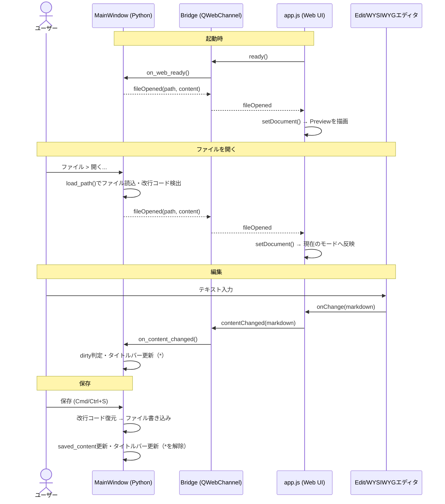

# Markdownエディタ 要件仕様書

## 1. 概要

macOSおよびWindowsで動作するクロスプラットフォームのMarkdownエディタを開発する。
GitHub Flavored Markdown (GFM) を基本記法とし、Mermaid記法による図表描画をサポートする。
Preview / WYSIWYG / Edit の3種類の表示モードを切り替えて利用できる。
OSSとして公開中

## 2. 対象プラットフォーム

* macOS

* Windows

* インストール不要でそのまま実行可能な形式（exe / .app）で配布する

* 配布チャネルは当面GitHub Releasesのみとする（パッケージマネージャ対応は将来検討）

## 3. 技術スタック

### 3.1 採用方針

WYSIWYG編集やMermaid描画はブラウザレンダリング（HTML/CSS/JS）を前提とする機能であり、
Tkinter等のPythonネイティブGUIのみでは実現が難しい。そのため以下のハイブリッド構成を採用する。

* **バックエンド／アプリシェル**: Python + [PySide6](https://doc.qt.io/qtforpython/) (Qt for Python)

  * ファイルの読み書き、OSネイティブなメニュー・ダイアログ、アプリのライフサイクル管理を担当

* **UI本体**: `QWebEngineView`（Chromiumベースの組み込みブラウザ）内で動作するHTML/CSS/JSアプリケーション

  * Preview / WYSIWYG / Edit 各モードの描画、Markdownパース、Mermaidレンダリングを担当

  * PythonとJS間は `QWebChannel` 等でブリッジし、ファイルI/Oや状態管理を連携する

  * ESM構成のライブラリ（CodeMirror 6 / Milkdown）は esbuild でバンドルし、成果物を `web/vendor/` に配置する

* **パッケージング**:

  * [PyInstaller](https://pyinstaller.org/) を採用し、`packaging/markdown_editor.spec` から macOS向け `.app` / Windows向け `.exe` を生成する（macOSは実装・動作確認済み。Windowsは同じspecファイルで生成できる見込みだが未検証）

  * いずれもPython実行環境のインストールなしでそのまま起動できることを必須要件とする（`web/` 一式をアプリ内に同梱し、QtWebEngineのフレームワーク/ヘルパープロセスもPyInstallerの標準フックで同梱される）

### 3.2 主要ライブラリ（候補）

| 用途                  | 候補                                                                    | 備考                                               |
| ------------------- | --------------------------------------------------------------------- | ------------------------------------------------ |
| Markdownパース/レンダリング  | [markdown-it](https://github.com/markdown-it/markdown-it) + GFMプラグイン群 | Preview/Editのハイライト表示にも利用                         |
| WYSIWYGエディタ         | [Milkdown](https://milkdown.dev/)（ProseMirrorベース）                     | GFM・Mermaidのプラグインが公式/コミュニティで提供されておりOSS(MIT)。採用確定 |
| Editモードエディタ         | [CodeMirror 6](https://codemirror.net/)                               | Markdownシンタックスハイライト・日本語IME対応。OSS(MIT)。採用確定       |
| Mermaid描画           | [Mermaid.js](https://mermaid.js.org/)                                 | 公式JSライブラリをそのまま利用                                 |
| コードブロックのシンタックスハイライト | Shiki または highlight.js                                                | Edit/Previewモードで使用                               |
| PDF/HTMLエクスポート      | Chromiumの印刷機能 (`QWebEngineView` の `printToPdf`) / 静的HTML生成            | Mermaid図はレンダリング後の状態を書き出す                         |

技術選定は実装フェーズで詳細な比較検証（バンドルサイズ、ライセンス、保守状況）を行った上で確定する。

### 3.3 処理概要

　Python（アプリシェル）とJS（Web UI）間の主要なやり取りを以下に示す。
両者は `QWebChannel` の `bridge` オブジェクトを介して非同期にメッセージをやり取りし、
Markdown文字列を単一の真実の情報源として同期する（4章参照）。


```mermaid
sequenceDiagram
    actor User as ユーザー
    participant Win as MainWindow (Python)
    participant Bridge as Bridge (QWebChannel)
    participant App as app.js (Web UI)
    participant Editor as Edit/WYSIWYGエディタ

    Note over Win,App: 起動時
    App->>Bridge: ready()
    Bridge->>Win: on_web_ready()
    Win-->>Bridge: fileOpened(path, content)
    Bridge-->>App: fileOpened
    App->>App: setDocument() → Previewを描画

    Note over User,Editor: ファイルを開く
    User->>Win: ファイル > 開く...
    Win->>Win: load_path()でファイル読込・改行コード検出
    Win-->>Bridge: fileOpened(path, content)
    Bridge-->>App: fileOpened
    App->>App: setDocument() → 現在のモードへ反映

    Note over User,Editor: 編集
    User->>Editor: テキスト入力
    Editor->>App: onChange(markdown)
    App->>Bridge: contentChanged(markdown)
    Bridge->>Win: on_content_changed()
    Win->>Win: dirty判定・タイトルバー更新（*）

    Note over User,Win: 保存
    User->>Win: 保存 (Cmd/Ctrl+S)
    Win->>Win: 改行コード復元 → ファイル書き込み
    Win->>Win: saved_content更新・タイトルバー更新（*を解除）
```

## 4. 表示モード

3種類の表示モードをUI上のタブまたはボタンで切り替えられるようにする。

1. **Preview モード**: Markdownソースをレンダリングした読み取り専用表示
2. **WYSIWYG モード**: リッチテキストエディタとして直接編集し、内部的にMarkdownとして保存
3. **Edit モード**: Markdownソースをシンタックスハイライト付きのテキストとして直接編集

* モード切替時、カーソル位置やスクロール位置をできる限り保持する（初版はスクロール位置の近似維持のみとする）

* 各モード間でのデータの不整合が起きないよう、Markdown文字列を単一の真実の情報源（Single Source of Truth）として同期する

* Editモードでは、ソース編集領域の右側にPreviewを並べて表示できる（4.1）

* レンダリング結果の本文幅は3段階（標準860px / 広め1100px / 画面いっぱい）から選べる（4.2）

### 4.1 Editモードの分割プレビュー

Editモードで、ソース編集領域（左）とPreview（右）を左右に並べて表示し、表示/非表示を切り替えられるようにする。

* **対象モード**: Editモードのみを対象とする。Previewモードには編集領域が無く、WYSIWYGモードは編集画面自体がレンダリング結果であるため、いずれも分割表示は行わない

* **切替方法**: 表示メニューの「プレビューを分割表示」（チェック項目 / ショートカット Cmd/Ctrl+\）で切り替える。Editモード以外では選択できない（グレーアウト）ものとする

* **状態の保持**: 分割表示のON/OFFと左右の幅比はアプリ実行中は保持し、他モードからEditモードへ戻った際に前回の状態を復元する。アプリ再起動をまたぐ永続化は本項のスコープ外とする（14章）

* **レイアウト**:

  * 左にソース編集（CodeMirror）、右にPreviewを配置し、境界にドラッグ可能な区切り（ディバイダ）を置く

  * 初期の幅比は50:50とし、各ペインの最小幅は240pxとする

  * ウィンドウ幅が両ペインの最小幅を確保できない場合は分割を一時的に解除し、ソース編集のみを表示する（ウィンドウを広げれば元の分割状態に戻す）

* **プレビューの更新**:

  * 入力に追従してリアルタイムに更新する。ただし入力の都度ではなく、入力が止まってから約300ms後にまとめて再描画する（デバウンス）

  * 再描画の前後でプレビューのスクロール位置（比率）を維持し、編集のたびに先頭へ戻らないようにする

  * Mermaid図は再描画のたびに再実行するとコストが高いため、図のソース文字列が前回と変化していないブロックは前回の描画結果（SVG）を再利用する

* **スクロール連動**:

  * 編集側のスクロールに合わせて、プレビュー側を同じ比率の位置へ追従させる（編集→プレビューの一方向）

  * プレビュー側を直接スクロールした場合は追従を一時的に停止し、編集側のスクロール操作が再開したら追従を再開する

  * ソース行とレンダリング結果の行単位での正確な対応付け（markdown-itのソース行情報を用いたマッピング）は本項のスコープ外とし、将来検討とする（14章）

* **既存機能との関係**:

  * 右クリックの挿入メニュー（5.1）は編集側でのみ有効とし、プレビュー側では表示しない

  * プレビュー側のリンククリックはPreviewモードと同じ挙動とする（5.3。内部Markdownリンクは未保存確認を経てアプリ内で開く）

  * 検索（10章）は引き続きPreviewモード専用とし、分割表示中のEditモードでは無効のままとする（`findText`はページ全体を対象とするため、ソース編集側の文字列までヒットしてしまうことによる）

  * 分割表示のままPreviewモードへ切り替えた場合は、既に表示しているプレビューのスクロール位置をそのまま引き継ぐ（編集側のスクロール比率での上書きは行わない）

* **実装方式**:

  * 既存の `#preview-pane` をそのまま右ペインとして再利用し、`#content` を横並び（`flex-direction: row`）へ切り替える。プレビューの描画処理（`app.js` の `render()`）はPreviewモードと共通のものを用いる

  * ディバイダはWebページ側の要素として実装する（Qt側の `QSplitter` はファイルツリー用の1段のみを維持する）

  * 切替の起点はQt側のメニューとし、チェック状態を `bridge.splitPreviewToggled(bool)` としてJSへ通知する。メニュー項目の有効/無効は既存のモード変更通知（`bridge.modeChanged`）を受けてQt側で切り替える

  * スクロール連動のため、CodeMirror側にスクロールイベントの通知手段を追加する（`frontend/editor.js` の変更を伴うため、`npm run build` の再実行が必要）

* **非機能**: 数千行程度の文書において、入力とプレビュー更新が体感上引っかからないこと

### 4.2 本文の表示幅

レンダリング結果の本文幅を3段階から選べるようにする。

現状は `.markdown-body` の `max-width: 860px` で固定しており、ウィンドウをどれだけ広げても
本文は860px（テキスト幅780px）で頭打ちになる。ワイドモニタで画面を使い切りたい場合と、
行が長くなりすぎるのを避けたい場合の両方に応えるため、切替可能とする。

#### 4.2.1 3段階の定義

| 設定     | `max-width` | テキスト幅       | 日本語   | 英語     |
| ------ | ----------- | ----------- | ----- | ------ |
| 標準（既定） | 860px       | 780px       | 48字/行 | 104字/行 |
| 広め     | 1100px      | 1020px      | 63字/行 | 138字/行 |
| 画面いっぱい | 上限なし        | ペイン幅 - 80px | 幅次第   | 幅次第    |

* 「画面いっぱい」の実測: ウィンドウ1920pxで101字/行、2560pxで141字/行、3440pxで196字/行

* ウィンドウ（またはペイン）の幅が上限に満たない場合、3設定はいずれも幅いっぱいに広がり同じ表示になる

* 左右の余白（`padding: 32px 40px 80px`）と中央寄せ（`margin: 0 auto`）は3設定とも変更しない

#### 4.2.2 切替方法と設定の保持

* **切替**: 表示メニューの「本文の幅」に「標準」「広め」「画面いっぱい」を排他選択（ラジオ）の項目として並べる。ショートカットは割り当てない

* **既定値**: 「標準」（現状と同じ見た目で起動する）

* **永続化**: 選択した値はアプリの再起動をまたいで復元する。保存方法は12章の設定ファイル（`view.contentWidth` に `standard` / `wide` / `full`）に従う

  * 不正な値や未設定の場合は「標準」にフォールバックする

  * これがアプリ初の永続設定となる。12章の仕組みは将来ほかの設定（分割表示の状態等、14章）にも流用できるようにしておく

#### 4.2.3 適用範囲

* **Previewモード**、**WYSIWYGモード**、**分割プレビューの右ペイン**（4.1）のすべてに適用する。3か所とも同じ `.markdown-body` クラスを使っているため、モードを切り替えても行長が変わらない

* Editモード（CodeMirror）のソース表示は対象外とする。ソースは編集領域の幅いっぱいを使う現行動作を維持する

#### 4.2.4 Mermaid図の配置

`pre.mermaid` は現在 `justify-content: center` で中央寄せしている。「画面いっぱい」では本文が左端から始まるのに対し図だけが画面中央に置かれ、視線が繋がらなくなる。

* 「画面いっぱい」を選択している間のみ図を左寄せにする。「標準」「広め」では現行どおり中央寄せを維持する

#### 4.2.5 エクスポートとの関係（7章）

* **HTMLエクスポート**: 出力するHTMLの `max-width` に現在の設定を反映する（画面で見るものであるため）

* **PDFエクスポート**: 用紙幅が固定であり、広げても本文が縮小されて読みにくくなるだけのため、**設定に関わらず860px固定**とする

* **Mermaid図の大きさ**: エクスポート時は画面外の作業用要素（幅800px固定）で描画しているため、本文幅の設定に関わらず図の寸法は変わらない

#### 4.2.6 本項のスコープ外

* 任意のpx値の指定、モードごとに異なる幅の設定、本文フォントサイズの変更

* 左右の余白量そのものの調整

* なお、アプリ内の余白（`32px 40px 80px`）とHTMLエクスポート時の余白（`32px 24px`）が現状で食い違っている。本項では揃えない（別途判断する）

## 5. Markdown記法サポート

GitHub Flavored Markdown (GFM) を基本とし、以下を含む。

* 見出し、強調（太字/斜体/取り消し線）、リスト（順序/非順序/タスクリスト）

* テーブル

* コードブロック（言語指定によるシンタックスハイライト）

* リンク、画像、オートリンク

* 引用

* 水平線

* インラインHTML（必要最小限、XSS対策を考慮）

### 5.1 右クリックメニューによる要素の挿入

WYSIWYG / Edit 両モードで、右クリックメニューから新規要素（テーブル・Mermaid図）を挿入できる。

* **起動方法**: 編集領域を右クリックするとカスタムメニューを表示する。ブラウザ標準の右クリックメニューは表示しない（コピー・貼り付けはキーボードショートカットで行う前提とする）

* **メニュー構成**: 「テーブル」（サブメニューでサイズ選択）・「フローチャート」・「シーケンス図」

* **テーブルの挿入**:

  * 「テーブル」にポインタを合わせると1階層奥のサブメニュー（グリッドピッカー）を表示する。最大10列×8行のマス目をマウスオーバーすると「3行×4列」のように選択中のサイズをハイライトとラベルで示し、クリックで確定して挿入する

  * 選択した行数にヘッダー行を含める（例: 3行×3列 → ヘッダー1行+データ2行）。GFMテーブルはヘッダー行が必須のため、1行のみ選択した場合はヘッダー1行+データ1行として挿入する

  * 全セル空のGFMテーブル（ヘッダー行+区切り行+データ行、列揃え指定なし）を挿入する

* **Mermaid図の挿入**: 「フローチャート」または「シーケンス図」を選択すると、既定テンプレート（フローチャート: ノード1個 / シーケンス図: 参加者2人とメッセージ1件）の ` ```mermaid ` ブロックを挿入する。挿入後の編集はWYSIWYGモードのGUIエディタ（6.1 / 6.2）またはEditモードのテキスト編集で行う

* **挿入位置**: カーソル位置（右クリックした位置）に挿入する。Editモードでは前後に空行を確保してブロックとして挿入する

* **キャンセル**: Escまたはメニュー外クリックでメニューを閉じる

* **スコープ**: 挿入後のテーブルの行・列の追加/削除は、WYSIWYGモードの既存テーブルツールバーで行う

### 5.2 クリップボード画像の貼り付け

WYSIWYG / Edit 両モードで、クリップボードに画像データがある状態で貼り付け（Cmd/Ctrl+V）を行うと、画像をファイルとして保存しMarkdownの画像リンクとして埋め込む。

* **対象モード**: WYSIWYG / Edit（Previewは読み取り専用のため対象外）

* **保存先**: 編集中の文書と同じフォルダ直下の `image` フォルダ（存在しなければ自動作成する）

* **ファイル名**: `image-YYYYMMDD-HHMMSS.png` のタイムスタンプ名。同名ファイルが存在する場合は `-2`、`-3`…の連番を付加して衝突を回避する。保存形式はPNG固定とする

* **埋め込み形式**: ``（文書からの相対パス）。WYSIWYGでは画像として表示されるノードを挿入し、Markdownへは同形式で書き出す

* **未保存の新規文書での貼り付け**: 保存先フォルダが未確定のため、「名前を付けて保存」ダイアログを自動で開く。保存が完了したら画像の保存と埋め込みを続行し、キャンセルされた場合は貼り付け全体を中止する

* **テキストと画像が両方ある場合**: テキストの貼り付けを優先する（表計算ソフトの表コピー等を壊さないため）。クリップボードが画像のみの場合に本機能が働く

* **相対パス画像の表示**: Preview / WYSIWYG 両モードで、文書フォルダを基準に相対パスを解決して画像を表示する。貼り付けた画像に限らず、既存文書に記述された相対パス画像も表示対象とする

* **孤児ファイル**: 画像は貼り付け時点で即座にディスクへ保存される。その後文書を保存せずに破棄した場合でも画像ファイルは削除しない（未使用画像のクリーンアップはv1ではスコープ外）

* **実装方式**: 貼り付けはWebビュー内のpasteイベントで検知し、画像データをBase64でQWebChannelブリッジ経由でPython側へ渡してファイル保存する。相対パスの解決には文書フォルダの情報を用い、レンダリング時に画像URLを文書基準へ書き換える

### 5.3 リンクのクリック挙動

Preview / WYSIWYG モードでMarkdown内のリンクをクリックした際、リンク先の種類に応じて遷移方法を振り分ける（現状は振り分けを行わず、アプリ内のWebビューがそのまま遷移してしまい、外部リンクをクリックすると編集画面が失われる問題があるため、これを解消する）。

* **相対パスの `.md` / `.markdown` ファイルへのリンク**: アプリ内でそのファイルを開く。現在の文書フォルダを基準にパスを解決し、既存の「ファイルを開く」と同様に未保存の変更があれば確認ダイアログを経由する

* **外部リンク（`http://` / `https://` 等）**: アプリ内では遷移せず、OS既定のブラウザで開く

* **その他の相対/絶対パスリンク（`.md` / `.markdown` 以外のファイル）**: OS既定のアプリケーションで開く（外部リンクと同様、アプリ内では遷移しない）

* **WYSIWYGでの修飾キー**: WYSIWYGは編集可能領域のため、単純クリックはリンクテキストの編集・カーソル移動に使えるようにし、Cmd/Ctrl+クリックのときのみ本挙動（振り分け）を発動する。Preview（読み取り専用）では修飾キー不要で単純クリックで発動する

* **実装方式**: Web側でリンクのクリックを検知し（`preventDefault`でページ内遷移を止める）、リンク先の生のhref文字列を `bridge` 経由でPython側へ渡して判定・実行する（`QDesktopServices.openUrl` によるOSへの委譲、または「アプリ内でファイルを開く」）。取り漏れた遷移が発生しないよう、`QWebEnginePage.acceptNavigationRequest`側でもリンククリックによるページ内遷移を安全網として抑止する

* **スコープ外**: 文書内アンカーリンク（`#見出し` 等によるスクロール）は現状スコープ外とする（見出しへのid付与を含め将来検討）

## 6. Mermaid対応

* ` ```mermaid ` コードブロックをMermaid.jsでレンダリングする

* フローチャート

  ```mermaid
  flowchart TB
      A["Markdown"]
      B{"モード"}
      C["Preview"]
      D["WYSIWYG"]
      E["Edit"]
      n1["marmeidエディタ"]
      n2("ズーム機能")
      n3["編集"]
      n4(["検索機能"])
      n5{"条件式"}
      n6["新規ノード"]
      n7["新規ノード"]
      A --> B
      B --> C
      B --> D
      B --> E
      D -.-> n1
      n1 --> n2
      n1 -.-> n3
      C --> n4
      E --> n5
      n5 -->|"はい"| n6
      n5 -->|"いいえ"| n7
  ```

* シーケンス図

  ```mermaid
  sequenceDiagram
      actor p1 as 参加者
      participant U as ユーザー
      participant W as Webアプリ
      participant D as データベース
      p1->>U: ログイン要求
      U->>W: ログイン要求
      W->>D: ユーザー情報を検索
      Note over W,D: サーバーサイド
      D-->>W: ユーザー情報を返却
      W->>D: 付加情報を検索
      D-->>W: 付加情報を返却
      W-->>U: ログイン成功
      U-->>p1: ログイン検証結果
  ```

* Preview / WYSIWYG 両モードで図として表示する

* Edit モードではコードブロックとして表示する

* 対応する図の種類（フローチャート、シーケンス図等）はMermaid.jsが標準サポートするものに準拠する

### 6.1 フローチャートのGUI編集

WYSIWYGモード上のMermaidフローチャート図をマウス操作で編集できるGUIエディタを提供する。

* **起動方法**: WYSIWYGモードでフローチャート図をダブルクリック（または図の編集ボタン）すると、専用のモーダルダイアログを開く

* **対象図種**: フローチャート（`flowchart` / `graph`）のみ。シーケンス図は6.2節のGUIエディタで対応し、それ以外の図種はテキスト編集のみとする

* **編集機能（v1）**:

  * ノード: 追加 / 削除 / ラベル編集（ダブルクリック） / 形状変更（四角・角丸・スタジアム・菱形・円・円柱）

  * エッジ: ノード間のドラッグによる接続作成 / 削除 / ラベル編集 / 線種変更（実線・点線・太線）・矢印の有無

  * 図全体: 方向切替（TB / BT / LR / RL）

  * Undo / Redo

  * 右クリックメニュー: キャンバスの空き領域では追加する要素（各形状のノード）を選択して追加できる。ノード上では「ここから接続を作成」（続けて接続先ノードをクリック）と削除、エッジ上では削除を提供する

  * ノード追加時の自動接続: ノードを追加する時点でいずれかのノードが選択中の場合、選択ノードから新規ノードへ実線・矢印ありのエッジを自動的に追加する（ツールバーの「＋ノード」・右クリックメニューの「○○ノードを追加」いずれの経路でも適用する）。エッジが選択中の場合や何も選択されていない場合は自動接続は行わない

* **レイアウト**: ノード位置はMermaidの自動レイアウトに準拠し、座標の永続化は行わない（Mermaidのフローチャート記法に座標指定構文がないため）。編集キャンバスは常にMermaidの描画結果を表示し、構造変更のたびに再レンダリングすることで最終的な見た目と常に一致させる

* **保存**: 編集結果をMermaidソースへシリアライズし、文書内の対象 ` ```mermaid ` ブロックを置き換える（Markdownを単一の真実の情報源とする原則を維持）。キャンセル時は変更を破棄する

* **互換性**: GUIの対応範囲外の記法（subgraph、classDef等のスタイル指定、対応外の図種）を含む図はGUI編集不可とし、その旨を表示してEditモードでのテキスト編集へ誘導する。対応範囲外の情報が暗黙に失われる破壊的変換は行わない

* **実装方式**: `frontend/diagram-editor.js` として実装しesbuildでバンドルする。内部にグラフモデル（ノード・エッジ・方向）を持ち、モデルからのMermaidソース生成は自前実装とする。既存図の読み込みにはMermaidのパーサAPI（`getDiagramFromText` / flowDb）の利用を実装フェーズ冒頭に技術検証する

* **スコープ外（将来検討）**: サブグラフの作成・編集、classDefによる色・スタイル指定

### 6.2 シーケンス図のGUI編集

WYSIWYGモード上のMermaidシーケンス図をマウス操作で編集できるGUIエディタを提供する。基本的な操作体系（モーダルダイアログ・右クリックメニュー・Undo/Redo・保存/キャンセル・互換性方針）は6.1のフローチャートGUI編集に準じるが、シーケンス図はメッセージの並び順自体が意味（時系列）を持つ点がフローチャートと異なるため、その点に対応したUI・編集機能とする。

* **起動方法**: WYSIWYGモードでシーケンス図をダブルクリック（または図の編集ボタン）すると、専用のモーダルダイアログを開く

* **対象図種**: シーケンス図（`sequenceDiagram`）のみ

* **編集機能（v1）**:

  * 参加者（participant / actor）: 追加 / 削除 / 名前変更 / 並び順（横方向）の変更（一覧上の左右入れ替えボタンまたはドラッグ） / 表示種別の切替（`participant`＝四角・`actor`＝棒人間）

  * メッセージ（矢印）: 追加 / 削除 / ラベル編集 / 矢印種別変更（実線矢印 `->>` ・破線矢印 `-->>` ・矢印なし `--`） / 自己メッセージ（同一参加者への送信）対応

  * Note注釈: 追加 / 削除 / テキスト編集。配置は `left of` / `right of` / `over` に対応する。`over` は単一参加者（`Note over A`）と複数参加者にまたがる範囲（`Note over A,B`）の両方を扱え、範囲の終端参加者はツールバーのセレクトで選択する（既定は起点と同じ参加者）。終端参加者が削除された場合は起点のみの `over` に自動で縮退する

  * メッセージ・Noteの並び順編集: 時系列順序をサイドリスト上のドラッグ&ドロップで並べ替え可能。新規メッセージ・Noteは、追加時点で何らかのメッセージ／Noteが選択中であればその直後に挿入し、何も選択されていなければ末尾に追加する

  * Undo / Redo

  * 右クリックメニュー: キャンバスの空き領域では参加者の追加（四角・棒人間）を提供する。参加者（ライフライン）上では「ここからメッセージを作成」（続けて宛先participantをクリック、同一participantをクリックすれば自己メッセージ）・Note追加・削除を提供する。メッセージ上では削除・矢印種別変更、Note上では削除を提供する

* **UI構成**: モーダルダイアログ内に、Mermaidの描画結果（参加者のライフライン表示）を示すキャンバスと、メッセージ・Noteをイベント順に並べたサイドリストを併用する。サイドリストの項目を選択するとキャンバス上の対応要素も選択状態になる（相互連動）。並び順の変更はサイドリスト上のドラッグ操作で行う

* **レイアウト**: 参加者の横位置・ライフラインの縦位置はMermaidの自動レイアウトに準拠し、座標の永続化は行わない。編集キャンバスは常にMermaidの描画結果を表示し、構造変更のたびに再レンダリングする

* **保存**: 編集結果をMermaidソースへシリアライズし、文書内の対象 ` ```mermaid ` ブロックを置き換える。キャンセル時は変更を破棄する

* **互換性**: GUIの対応範囲外の記法（`loop` / `alt` / `opt` / `par` 等の制御構造、`activate` / `deactivate`、その他対応外の記法）を含む図はGUI編集不可とし、その旨を表示してEditモードでのテキスト編集へ誘導する。対応範囲外の情報が暗黙に失われる破壊的変換は行わない

* **実装方式**: 既存の `frontend/diagram-editor.js` に図種判定を追加し、シーケンス図用のパーサ・シリアライザ・UIを実装する。既存図の読み込みにはMermaidのパーサAPI（`getDiagramFromText` およびシーケンス図用DB）の利用を実装フェーズ冒頭に技術検証する

* **スコープ外（将来検討）**: `loop` / `alt` / `opt` / `par` 等の制御構造、`activate` / `deactivate`（活性化バー）、`participant ... as ...` エイリアスの高度な編集、classDefによる色・スタイル指定

## 7. エクスポート機能

* **PDFエクスポート**: 現在編集中のMarkdown（Mermaid図を含むレンダリング結果）をPDFファイルとして出力する

* **HTMLエクスポート**: レンダリング結果を単体で閲覧可能な静的HTMLファイルとして出力する

* **起動方法**: ファイルメニューの「HTMLとしてエクスポート...」「PDFとしてエクスポート...」から保存先を指定する

* **出力内容**: 現在の編集内容（未保存の変更を含む）をPreviewモードと同じレンダリングで出力する。Mermaid図はレンダリング後のSVGとして埋め込む

* **HTML形式**: CSSをインライン埋め込みした自己完結の単一ファイル（閲覧にJavaScript・外部ファイル不要）。表示テーマはOS設定（ライト/ダーク）に追従する

* **PDF形式**: エクスポート用HTMLを非表示のWebEngineページへ読み込み、Chromiumの印刷機能（`printToPdf`）でPDF化する（画面表示中のモードには影響しない）

* **完了通知**: 出力の完了・失敗はステータスバーおよびエラーダイアログで通知する

## 8. テーマ

* ライトテーマ / ダークテーマを切り替え可能とする

* OSのダーク/ライト設定に追従するオプションを提供する

## 9. ファイル操作（基本機能）

* Markdownファイル（.md）を開く / 保存 / 名前を付けて保存

* 新規作成

* 未保存変更のタイトルバー表示（\*マーク）と、未保存のまま閉じる／別ファイルを開く際の確認ダイアログ

* 改行コードの維持（CRLFのファイルはCRLFのまま保存する。内部処理はLFに正規化する）

* 最近使用したファイルの一覧表示

### 9.1 ファイルツリー（フォルダナビゲーション）

フォルダ内のMarkdownファイルをツリー表示し、クリックで開けるナビゲーションパネルを提供する。

* **配置と表示切替**: ウィンドウ左側のサイドバーとして表示する。境界のドラッグで幅を調整でき、表示メニューの「ファイルツリー」（Cmd/Ctrl+Shift+E）で表示/非表示を切り替えられる

* **ルートフォルダの決定**:

  * ファイルを開いたとき、そのファイルが現在のルート配下になければ、親フォルダを自動的にツリーのルートにする（配下にある場合はルートを維持し、選択のみ更新する）

  * ファイルメニューの「フォルダを開く...」で任意のフォルダ（プロジェクトルート等）を明示的にルートとして選択できる

  * ルート未確定の間（起動直後のウェルカム文書・未保存の新規文書のみの状態）はツリーを空表示とする

* **表示対象**: フォルダとMarkdownファイル（`*.md` / `*.markdown`）のみを表示する。それ以外のファイル（画像等）は表示しない

* **ファイルを開く**: シングルクリックで開く。未保存の変更がある場合は既存の保存確認ダイアログを経由し、キャンセル時は開かない。現在開いているファイルはツリー上で選択状態として示す

* **新規Markdown作成**: ツリーの右クリックメニュー「新規Markdownファイル...」で、選択中のフォルダ（ファイル上ならその親フォルダ）にファイル名を入力して空のMarkdownファイルを作成し、そのまま開く。既存ファイルと同名の場合はエラーを表示して作成しない

* **ファイルシステムとの同期**: フォルダ内のファイル追加・削除・リネームはツリーへ自動反映する

* **実装方式**: Qt側で `QTreeView` + `QFileSystemModel`（名前フィルタでMarkdownのみ表示、ファイルシステム監視は標準機能を利用）を用い、`QSplitter` でWebビューの左に配置する

* **スコープ外（将来検討）**: ツリーからのリネーム・削除・移動、複数ルート（ワークスペース）、前回開いたフォルダの記憶、ツリー内検索

### 9.2 外部での更新の検知と再読み込み

開いているファイルがアプリの外（他のエディタ、ビルドスクリプト、11章のExcel変換、Git操作等）で
書き換えられた場合に、それを検知してユーザーが再読み込みできるようにする。
本アプリをビューアとして使いながら別のツールでファイルを更新する使い方を想定する。

#### 9.2.1 検知

* **対象**: 現在開いている1ファイルのみ。ファイルツリーの増減は9.1のとおり既に自動反映されるため対象外とする

* **方式**: `QFileSystemWatcher` で「開いているファイル」と「その親フォルダ」の両方を監視する。親フォルダも監視するのは、削除後に再作成された場合にファイルの監視を再登録するため（削除されると監視対象から外れ、存在しないパスは再登録できない）

* **自動リロードはしない**: 検知しても内容は差し替えず、常に通知バーを表示してユーザーの操作を待つ。未保存の変更があるかどうかで挙動は変えず、バーの文言のみ変える

* **デバウンス**: 通知を出す前に短い待ち時間（200ms程度）をおいてイベントを合流させる。書き込み途中の中途半端な内容を読まないための待ちも兼ねる

* **自分の保存を除外する**: アプリ自身がファイルを書いた場合も通知が飛ぶため、ディスク上の内容を読んで保存済み内容と一致する場合は通知しない。これにより「保存」「名前を付けて保存」「Excel変換の出力」を誤検知しない

* **通知後にユーザーが保存した場合**: アプリ側の内容がディスクに書かれて競合が解消されるため、通知バーを閉じる

#### 9.2.2 通知バー

* 検索バー（10章）と同じ位置（Webビューの上）にQtのバーとして表示する。3モードすべてで同じ見た目・同じ挙動になり、モード切替の影響を受けない

* **未保存の変更が無い場合**: 「このファイルは外部で変更されました」＋［再読み込み］［閉じる］

* **未保存の変更がある場合**: 「このファイルは外部で変更されました。再読み込みすると編集中の内容は失われます」＋［破棄して再読み込み］［閉じる］。誤操作を防ぐため、この状態での再読み込みは確認ダイアログを経由する

* **ファイルが削除・リネームされた場合**: 「ファイルが見つかりません」＋［閉じる］のみ（再読み込みは提示しない）

* ［閉じる］で消したあと、さらに外部で更新されれば再度表示する

#### 9.2.3 再読み込み時に維持する状態

再読み込みは「別のファイルを開く」とは別の経路とする（既存の文書差し替えはスクロールを先頭に戻すため）。

* **Preview / WYSIWYG**: スクロール位置を比率（`scrollTop / (scrollHeight - clientHeight)`）で維持する。行数が変わっても見ていた位置の近くに留まる

* **Edit**: CodeMirrorのカーソル位置（文字オフセット。新しい文書長でクランプする）とスクロール比率を維持する

* **分割プレビュー（4.1）が有効な場合**: 編集側の位置を維持し、プレビューの追従状態もそのまま引き継ぐ

* 改行コードは読み込み直しの際に再検出する（外部ツールがCRLF↔LFを変えた場合に追従する）

* 再読み込み後は保存済み状態（タイトルバーの `*` なし）になる

#### 9.2.4 削除・リネームされた場合

* **表示中の内容はそのまま保持し、未保存扱いにする**（タイトルバーに `*` を表示）。そのまま「保存」すればファイルを復活させられる

* ファイルパスは保持したままにする（別名保存を強要しない）

* 同じパスにファイルが再作成されたら監視を再登録し、以降の更新を再び検知できる状態に戻す

#### 9.2.5 手動での再読み込み

* ファイルメニューに「再読み込み」（F5）を追加し、外部更新の検知に関係なくいつでも読み直せるようにする。未保存の変更がある場合は確認ダイアログを経由する

#### 9.2.6 本項のスコープ外

* 外部の変更とアプリ側の編集内容のマージ（3-way merge）や差分表示。競合時は「破棄して再読み込み」か「編集内容を保持」の二択とする

* 文書から参照している画像ファイルの更新検知（本文の再読み込み時には併せて再表示される）

* 監視の一時停止・無効化の設定項目

## 10. 検索機能（Previewモード）

Previewモードで表示中の文書に対するテキスト検索を提供する。

* **起動/終了**: Cmd/Ctrl+F で検索バーを表示する。Esc または閉じるボタンで終了し、ハイライトを解除する

* **インクリメンタル検索**: 入力の都度ヒット位置を更新する

* **ヒット表示**: 全ヒットをハイライトし、現在のヒットを強調表示する。ヒット件数と現在位置（例: 3/12）を表示する

* **移動**: Enter / Shift+Enter（または ↑↓ ボタン）で次/前のヒットへ移動し、該当位置へスクロールする

* **大文字小文字**: 区別しない（区別オプションは将来検討）

* **日本語対応**: 日本語を含むマルチバイト文字列を検索できること（検索バーはIME入力に対応する）

* **対象範囲**: レンダリング結果として表示されているテキスト（テーブル・コードブロック含む）

* **実装方式**: `QWebEnginePage.findText()`（Chromium組み込みの文書内検索）を利用し、検索バーはQt側のツールバーとして実装する。ハイライト・前後移動・件数取得はAPIの標準機能を用いる

* Edit / WYSIWYG モードでの検索、および置換機能は本項のスコープ外とする（14章参照）

## 11. Excelファイルの取り込み（Excel → Markdown 変換）

指定したExcelファイルを読み込み、シート単位でMarkdownファイルへ変換して保存する。

### 11.1 入力と起動方法

* **起動方法**: ファイルメニューの「Excelから変換...」でファイル選択ダイアログを開き、変換対象のExcelファイルを1つ指定する

* **対応形式**: `.xlsx` / `.xlsm` のみ。旧形式 `.xls` は非対応とし、指定された場合は「非対応の形式」としてエラー表示する

* **実装ライブラリ**: `openpyxl`（罫線・結合セル・表示形式・文字装飾・ハイパーリンクをセル単位で取得できる）。依存として `pyproject.toml` に追加し、PyInstallerのパッケージにも同梱する

### 11.2 出力先

* 指定したExcelファイルと**同一ディレクトリ**に、**拡張子を除いたExcelファイル名**のフォルダを作成する

* シートごとに `<シート名>.md` を作成する。文字コードはUTF-8、改行はLFとする

* **ファイル名のサニタイズ**: Excelはシート名に `/ \ : * ? [ ]` を許可しないが、`< > " |`・先頭/末尾の空白・Windowsの予約名（`CON` 等）は許容されるためファイル名としては不正になり得る。以下の順で正規化する

  * `< > " |` を `_` に置換し、先頭/末尾の空白とピリオドを除去する

  * Windows予約名に一致する場合は末尾に `_` を付ける

  * 結果が空文字列になった場合は `sheet` とする

  * 正規化の結果が他シートと重複した場合は `-2`, `-3` の連番を付ける

* **出力先フォルダが既に存在する場合**: 「既に存在します。上書きしますか？」の確認ダイアログを表示し、OKなら同名のmdのみ上書きする（フォルダ内の無関係なファイルは削除しない）。キャンセルなら変換を行わない

### 11.3 変換対象シート

* **非表示シートは出力しない**

* **空シート**（値もテーブルも存在しないシート）はmdファイルを作成しない

* 各mdの先頭に `# <シート名>` の見出しを自動で付与する

### 11.4 テーブル判定（罫線ベース）

セルの内容ではなく**罫線の有無**でテーブル領域を判定する。

* **罫線セルの定義**: 上下左右の**いずれか1辺以上**に罫線（`none` 以外の線種）を持つセルを罫線セルとする

* **領域の切り出し**: 罫線セルの4近傍連結成分を求め、その外接矩形をテーブル候補とする。外接矩形が重なり合う候補どうしは1つの領域に統合する

* **最小サイズ**: 2行×2列未満の候補はテーブルとせず、非テーブル領域（11.6）として扱う。これにより「見出しに下線を1本引いただけ」のセルを表として誤検知しない

* **矩形内の穴**: 外接矩形の内側にある罫線の無いセルもテーブルの一部として扱い、空欄として出力する

* **結合セルの扱い**: 結合を解除し、左上のセルにのみ値を出力して残りは空欄とする。ただし領域の外接矩形を求める際は結合範囲全体を占有セルとして扱う

* **ヘッダー行**: テーブル領域の**先頭行を常にヘッダー行**として出力する（GFMテーブルはヘッダー行が必須のため）

### 11.5 セルの値と書式の変換

* **表示形式**: Excelの表示形式を適用した後の文字列を出力する（日付・通貨・パーセント等が画面上の見た目どおりになる）

* **文字装飾**: 太字 → `**`、斜体 → `*`、取り消し線 → `~~` を反映する。セルの背景色・文字色・フォントサイズは反映しない

* **ハイパーリンク**: セルに設定されたリンクを `[表示文字列](URL)` として出力する

* **セル内改行**: `<br>` に変換する（GFMテーブル内で改行を表現するため）

* **エスケープ**: セル値に含まれる `|` はテーブル内で `\|` にエスケープする

* **数式**: Excelが保存した計算結果（キャッシュ値）を使用する。キャッシュ値が存在しない場合（Excel以外のツールが生成したファイル等）は空欄とし、変換完了時に「計算値を取得できなかったセルがある」旨を通知する

* 空のセルは空欄として出力する

### 11.6 非テーブル領域の扱い

* テーブルと判定されなかった領域は、**行単位の段落テキスト**として出力する

* 同じ行にある値の入ったセルを左の列から順に半角スペースで連結し、1行の段落とする

* 値の無い行は段落の区切り（空行）として扱う

* 連続する行は1つの段落にまとめるが、Markdownは単なる改行を空白として扱うため、行末に `<br>` を付けてExcelの行の区切りを保つ（11.5のセル内改行と同じ方式）

* 文字装飾・ハイパーリンクの変換規則は11.5と同じものを適用する

### 11.7 出力順序と完了時の挙動

* シート上端の行から順に走査し、テーブル領域と非テーブル領域を**行位置の順**でmdに並べる

* 変換完了後、生成したフォルダをファイルツリーのルートとして表示し、先頭シートのmdを開く。未保存の変更がある場合は既存の保存確認ダイアログを経由し、キャンセル時はファイルを開かない（ツリーの表示は更新する）

* **エラー処理**: あるシートの変換に失敗しても中断せず次のシートへ進み、最後に「成功 n件 / 失敗 m件（シート名と理由）」をまとめてダイアログで報告する

* シート数が多い場合に備え、変換中はステータスバーに進捗（`3 / 12 シート`）を表示する

### 11.8 本項のスコープ外

* **描画オブジェクト（画像・グラフ・図形・テキストボックス）は変換対象外**とする。シートに含まれていても無視し、mdには出力しない（扱いの検討結果は14.1に記録する）

* オブジェクトがあった旨はmdファイルに追記する

* 条件付き書式、セル背景色、列幅・行高、フィルタ、ピボットテーブル、複数ブックの一括変換、およびMarkdown → Excelの逆変換

## 12. 設定の永続化

アプリの設定（4.2の本文幅など）を、アプリの再起動をまたいで保持する。

### 12.1 方針

* **レジストリやOSの設定データベースは使わない**。`QSettings` の既定（Windows: レジストリ、macOS: plist）を避け、アプリが自分で読み書きするJSONファイル1つで完結させる

* 設定ファイルは**実行ファイルと同じ場所**に置き、マシンの他の場所に痕跡を残さない（USBメモリ等での持ち運びを想定する）

### 12.2 設定ファイル

* ファイル名 `markdown-editor-settings.json`、UTF-8、改行はLF

* スキーマ

  ```json
  {
    "version": 1,
    "view": { "contentWidth": "standard" }
  }
  ```

* `version` は将来のキー追加・移行に備えて持たせる

* 読み取り時に知らないキーがあっても捨てず、保存時にそのまま書き戻す（新しいバージョンで書かれた設定を、古いバージョンで起動した際に失わないため）

### 12.3 置き場所

PyInstallerでビルドした実行ファイルで実測した結果に基づき、実行形態ごとに次のとおりとする。

| 実行形態                     | 設定ファイルの場所          | 解決方法                  |
| ------------------------ | ------------------ | --------------------- |
| Windows（onefileの `.exe`） | `.exe` と同じフォルダ     | `sys.executable` の親   |
| macOS（`.app`）            | **`.app` を含むフォルダ** | `sys.executable` の3つ上 |
| macOS（単体バイナリ）            | バイナリと同じフォルダ        | `sys.executable` の親   |
| 開発実行（PyInstaller未使用）     | リポジトリ直下            | `.gitignore` に追加する    |

* macOSで `.app` の**内部**（`Contents/MacOS/`）に書かないのは、コード署名が壊れることと、アプリを入れ替えると設定が消えるため

* **`sys._MEIPASS` は使わない**。onefileの展開先の一時ディレクトリ（実測で `/var/folders/.../T/_MEIxxxxxx`）であり、終了時に削除されるため保存先にならない

### 12.4 読み書きの挙動

* **読み込み**: 起動時に1回だけ行う。ファイルが無い / JSONとして壊れている / 値の型が想定と違う場合は、その項目を既定値として扱い起動を続行する（設定ファイルの破損でアプリが起動できなくなることを避ける）

* **書き込み**: 設定を変更するたびに即時保存する。一時ファイルへ書いてから `os.replace` で置き換え、書き込み途中の壊れたファイルを残さない

* **書き込めない場合**: `Program Files` 直下など読み取り専用の場所にアプリを置いた場合は保存できない。この場合も**他の場所へフォールバックしない**（痕跡を残さない方針に反するため）。最初の保存失敗時にステータスバーへ「設定を保存できませんでした（この起動中のみ有効）」と表示し、以降はメモリ上でのみ設定を保持する

### 12.5 本項のスコープ外

* 設定画面（ダイアログ）の提供。設定の変更は各機能のメニュー項目から行う

* 設定のインポート/エクスポート、複数プロファイル、設定ファイルの場所の変更

## 13. 非機能要件

* 起動・保存・モード切替等の基本操作について体感速度を損なわないこと

* OSSとして公開することを前提に、採用ライブラリのライセンス（MIT/Apache-2.0等）に矛盾がないよう選定する

* 本アプリ自体のライセンスはMITとする（確定）

### 13.1 配布物のサイズ（onefile）

onefile（単一実行ファイル）にすると配布物が大きくなるため、削減余地を調査した結果を記録する。

#### 13.1.1 現状の実測値

macOS（Apple Silicon / PySide6 6.11.1 / PyInstaller 6.21.0）で `packaging/markdown_editor.spec` をビルドした実測。

| 項目                     | 値                        |
| ---------------------- | ------------------------ |
| 実行ファイル                 | 185,438,448 B（約 177 MiB） |
| 起動時に一時ディレクトリへ展開されるサイズ   | 522.7 MB / 3,150 ファイル    |
| 起動にかかる時間（画面が出るまで、3回計測） | 7.4 / 7.5 / 13.6 秒       |

大きさのほぼすべてはQtWebEngine（Chromium）である。展開後の内訳の上位は
`QtWebEngineCore` 本体 228 MB、`qtwebengine_locales` 45 MB、`icudtl.dat` 10 MB で、
**これらはレンダリングの中核なので削減対象にできない**（3.1の技術選定を変えない限り）。

#### 13.1.2 削減できるもの

PyInstallerのQtフックは「QtWebEngineCoreが依存しているモジュール」を起点に芋づる式に収集するため、
本アプリが使わないものまで大量に同梱される。実際の依存関係を
`otool -L`（macOS）/ PEインポートテーブル（Windows）で辿って確認したところ、
**必要なQtモジュールはmacOSで17個、Windowsで16個**（`QtCore` `QtGui` `QtWidgets` `QtNetwork`
`QtWebEngineCore` `QtWebEngineWidgets` `QtWebChannel` `QtPrintSupport` `QtQml` 系4種
`QtQuick` `QtQuickWidgets` `QtOpenGL` `QtPositioning` ほか）にとどまり、残りは不要である。

specファイルで `a.binaries` / `a.datas` を絞り込むことで、以下を除外できる。

| 除外するもの                                | macOS実測    | Windows見積り  | 根拠                                                       |
| ------------------------------------- | ---------- | ----------- | -------------------------------------------------------- |
| 未使用のQtモジュール本体（Charts / 3D / Quick3D 等） | 70.5 MB    | 83.1 MB     | 依存関係の推移閉包に含まれない                                          |
| `qtwebengine_locales` のうち ja / en-US 以外 | 44.2 MB    | 44.4 MB     | WebEngineのUI文言。日本語＋英語で足りる                                 |
| `qml/`（QMLモジュール一式）                    | 31.0 MB    | 26.6 MB     | WebEngineはQtQuickのC++側だけを使い、QMLモジュールは読まない                 |
| 未使用のPySide6バインディング（`QtOpenGL` 等）       | 14.3 MB    | 24.7 MB     | C++ライブラリ本体は残す。Python側から `import` しないものだけ除外                |
| `qtwebengine_devtools_resources.pak`  | 11.7 MB    | 11.6 MB     | DevTools（リモートデバッグ画面）専用                                    |
| `translations/*.qm`（Qt標準UIの翻訳）         | 9.4 MB     | 15.9 MB     | 本アプリは `QTranslator` を使っていないため読み込まれない                      |
| 未使用のQtプラグイン（qmltooling / position 等）   | 3.5 MB     | 14.5 MB     | 画像形式は jpeg / gif / ico / svg のみ残す                         |
| `*.debug.pak` / `*.debug.bin`         | （macOSには無い） | 80.9 MB     | Windowsホイールのみが同梱するデバッグ用リソース                               |
| **合計**                                | **184.7 MB** | **301.7 MB** |                                                          |

補足として、`imageformats/qpdf` プラグイン（123 KB）が `QtPdf`（15 MB）を丸ごと引き込んでいる。
このように「小さなプラグインが大きなライブラリを連れてくる」形が多く、プラグイン側から絞るのが効く。

#### 13.1.3 効果（macOSは実測、Windowsは見積り）

| 項目          | 現状                     | 絞り込み後                     | 差             |
| ----------- | ---------------------- | ------------------------- | ------------- |
| 実行ファイル（macOS） | 185,438,448 B（177 MiB） | 123,540,624 B（118 MiB）    | **−33.4%**    |
| 展開後（macOS）  | 522.7 MB / 3,150ファイル   | 338.0 MB / 135ファイル        | −184.7 MB     |
| 起動時間（macOS） | 7.4 / 7.5 / 13.6 秒     | 6.9 / 6.9 / 6.9 秒         | 短縮かつ安定        |
| 実行ファイル（Windows） | —                      | —                         | **圧縮後 約 −100 MB** |

Windowsの数値は win_amd64 ホイールの中身に同じ除外規則を当てはめ、
zip内の圧縮後サイズ（deflate）を積み上げた見積りであり、実機ビルドでの確認は行っていない。

#### 13.1.4 採用しない案

| 案                        | 判断                                                                                      |
| ------------------------ | --------------------------------------------------------------------------------------- |
| UPXで実行ファイルを圧縮            | onefileの中身はすでにzlib圧縮済みで二重圧縮の効果が薄い。加えて起動が遅くなり、ウイルス対策ソフトの誤検知要因になる                          |
| onedir（フォルダ配布）に戻す        | 合計サイズはむしろ増える。「配布物を1ファイルにする」方針（2章）とも矛盾する                                                 |
| macOSでuniversal2を単一アーキに削る | **PyInstallerが既に自動で実施済み**。`lipo` で明示的に削る版を実際にビルドして比較したが、実行ファイルサイズは 123,540,624 → 123,540,096 B とほぼ変わらなかった |
| `icudtl.dat` の削減         | Qtを自前ビルドしない限りホイールの内容を変えられない                                                              |
| QtWebEngine以外への置き換え      | Mermaid・シンタックスハイライト・WYSIWYGをすべてWeb技術で実現している構成（3.1）の前提が崩れる                                |

#### 13.1.5 リスクがあるため既定では除外しないもの

| 対象                                             | サイズ（Windows） | リスク                                                            |
| ---------------------------------------------- | ----------- | -------------------------------------------------------------- |
| `opengl32sw.dll`                               | 20.6 MB     | GPUドライバが使えない環境（リモートデスクトップ・仮想マシン）でのソフトウェア描画フォールバック。外すと描画できない環境が出る |
| ffmpeg（`avcodec` / `avformat` / `avutil` / `sw*`） | 18.8 MB     | HTML5の音声・動画再生用。`Qt6WebEngineCore.dll` のインポートテーブルには現れず動的に読み込まれるため起動は壊れないと考えられるが、Windows実機で未検証 |

#### 13.1.6 確認方法

絞り込んだ構成が壊れていないことは、以下で確認する。

* frozenビルドを実際に起動し、Preview / WYSIWYG / Edit の3モードで
  見出し・表・シンタックスハイライト・Mermaid図が描画されること（CDP経由でDOMを検査）
* frozenビルド内でPDFエクスポート（`printToPdf`）が成功し、`%PDF-` で始まるファイルが生成されること
* frozenビルド内で `openpyxl` が読み込め、Excel変換（11章）が例外なく完了すること
* 設定ファイルの保存（12章）が成功すること

## 14. スコープ外・今後の検討事項

以下は今回のv1スコープには含めないが、将来的な拡張候補として記録する。

* ファイルツリー／フォルダ表示によるファイルナビゲーション

* タブによる複数ファイルの同時編集

* 自動保存

* 検索のEdit / WYSIWYGモード対応、および置換機能（Previewモードの検索は10章で対応）

* 分割プレビュー（4.1）の拡張: ソース行単位でのスクロール同期、分割状態・幅比のアプリ再起動をまたぐ永続化

* 外部での変更とアプリ側の編集内容のマージ（差分表示・3-way merge）。検知と再読み込み自体は9.2で対応する

### 14.1 Excel取り込みにおける描画オブジェクトの扱い（検討結果）

11.8のとおりv1では対象外としたが、将来対応する場合の選択肢を調査結果とともに記録する。前提として `openpyxl` には以下の制約がある。

* **画像**: Pillowが導入されていない環境では openpyxl が画像を読み込まず破棄する（`openpyxl/reader/drawings.py`）。xlsx（zip）内の `xl/media/` から直接抽出し、配置情報を `xl/drawings/drawingN.xml` から読めばPillowなしでも取得できる

* **グラフ**: オブジェクトとしては取得できるが、**描画済み画像ではなく系列データと参照範囲のみ**を保持している

* **図形・テキストボックス**: openpyxlは非対応。さらに未対応の図形が含まれる描画パートでは、**同じパート内の画像・グラフごと読み捨てられる**実装になっている（`SpreadsheetDrawing.from_tree` のTypeErrorを警告付きで握りつぶす）

上記を踏まえた対応案は以下のとおり。

| 案                | 内容                                                                                                                              | 評価                                                        |
| ---------------- | ------------------------------------------------------------------------------------------------------------------------------- | --------------------------------------------------------- |
| A. 外部依存なしで最大限対応  | 画像はzipから直接抽出して `image/` に保存しmdへ埋め込む。グラフは系列データからMarkdownテーブル＋Mermaid `xychart` として再現。テキストボックスは描画XMLを自前パースして文字列化。その他の図形はコメント行のみ残す | 追加インストール不要で「インストール不要で実行可能」という配布要件（2章）を維持できる。図形の見た目は再現されない |
| B. LibreOffice併用 | LibreOfficeが導入済みならheadlessで該当範囲をレンダリングし、**隣接するオブジェクトをまとめて1枚の画像**として保存・埋め込む。未導入時はAへフォールバック                                       | 見た目の再現度は最も高いが、環境依存で結果が変わり、実装・検証コストが大きい。配布要件とも整合しない        |
| C. 画像のみ対応        | 埋め込み画像だけを抽出し、グラフ・図形・テキストボックスは無視する                                                                                               | 最小実装。表と画像だけの資料には十分                                        |

「隣接するオブジェクトをまとめて画像化する」案（B）を採る場合は、まとめる範囲の定義（バウンディングボックスの重なり／一定距離以内での連結）と、その画像をmdのどの位置に挿入するか（アンカーセルの行位置）を別途決める必要がある。
