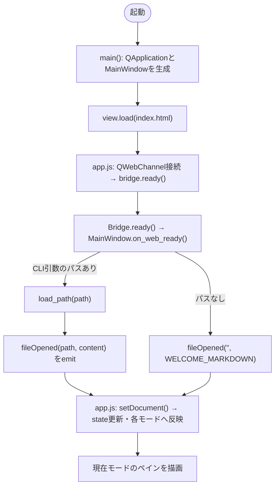
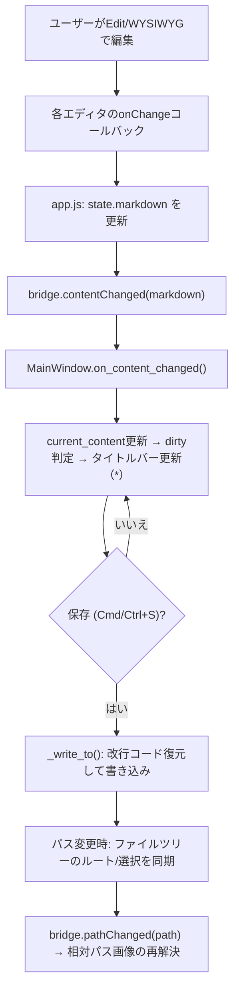
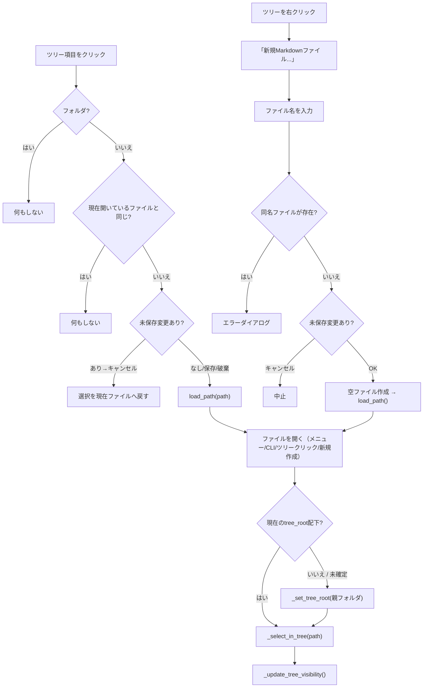
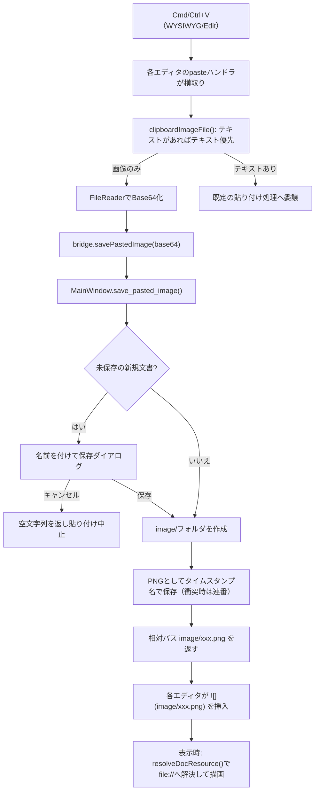
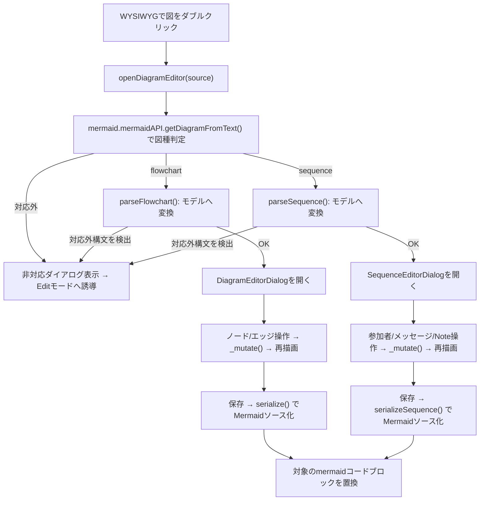
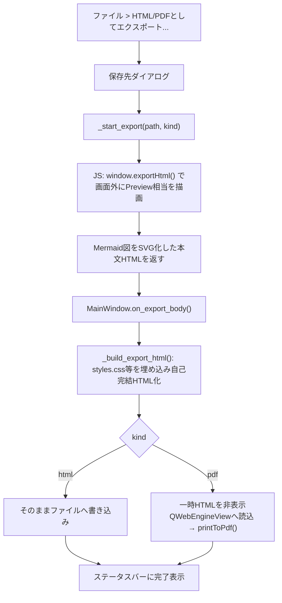

# ソースコード構成ドキュメント

本ドキュメントは `docs/spec.md`（要件仕様書）に対して、実装済みソースコードの
構成・役割・呼び出し関係を整理したもの。仕様の変更に追従して更新すること。

## 1. 全体構成

```
frontend/                       # esbuildでバンドルするESMソース
├── editor.js                   # Edit モード（CodeMirror 6） → vendor/editor-bundle.js
├── wysiwyg.js                  # WYSIWYG モード（Milkdown） → vendor/wysiwyg-bundle.js
└── diagram-editor.js           # Mermaid GUIエディタ（wysiwyg.jsから読み込まれ、
                                 #   wysiwyg-bundle.js に同梱される）

src/markdown_editor/
├── __init__.py
├── main.py                     # PySide6 アプリシェル（ウィンドウ・メニュー・
                                 #   ファイルI/O・ファイルツリー・エクスポート・貼り付け画像保存）
└── web/                        # QWebEngineView 内で動作するUI本体
    ├── index.html              # ペイン構造・スクリプト読み込み順を定義
    ├── app.js                  # Markdownレンダリング・モード管理・右クリックメニュー・
                                 #   Pythonブリッジ配線
    ├── styles.css              # 全モード共通スタイル（ライト/ダーク対応）
    └── vendor/                 # ビルド生成物 + 外部ライブラリ（そのまま同梱）
        ├── editor-bundle.js    # ← frontend/editor.js
        ├── wysiwyg-bundle.js   # ← frontend/wysiwyg.js + diagram-editor.js
        ├── wysiwyg-bundle.css
        ├── markdown-it.min.js / markdown-it-task-lists.min.js
        ├── highlight.min.js / highlight-github(-dark).min.css
        └── mermaid.min.js

tests/                          # オフスクリーンQt結合テスト（PySide6 + QT_QPA_PLATFORM=offscreen）
├── test_save_logic.py          # 新規/開く/保存/未保存確認・改行コード維持
├── test_search.py              # Previewモードの検索（インクリメンタル・前後移動・モード連動）
├── test_search_layout.py       # 検索バーの高さ（レイアウト崩れ検知）
├── test_paste_image.py         # クリップボード画像の保存・相対パス画像の表示解決
├── test_export.py              # HTML/PDFエクスポート
└── test_file_tree.py           # ファイルツリーのルート決定・クリック・新規作成・トグル
```

## 2. レイヤーと責務

| レイヤー | 主なファイル | 責務 |
| --- | --- | --- |
| Pythonアプリシェル | `main.py` | ウィンドウ／メニュー／ファイルI/O／ファイルツリー／エクスポート（PDF/HTML）／貼り付け画像の保存。`QWebChannel`で`bridge`オブジェクトをJSへ公開 |
| Web UI 基盤 | `web/index.html`, `web/app.js`, `web/styles.css` | 3モードのペイン切替、markdown-itによるPreviewレンダリング、右クリックメニュー、Pythonブリッジの受け口 |
| Edit モード | `frontend/editor.js` | CodeMirror 6ラッパー（`SourceEditor`）。ブロック挿入APIを提供 |
| WYSIWYG モード | `frontend/wysiwyg.js` | Milkdownラッパー（`WysiwygEditor`）。画像・図・テーブルのNodeView、貼り付けハンドラ |
| Mermaid GUI編集 | `frontend/diagram-editor.js` | フローチャート/シーケンス図の専用編集ダイアログ（`DiagramEditorDialog` / `SequenceEditorDialog`） |

## 3. 主要な型・クラス

### main.py

* `AppWebPage(QWebEnginePage)` — JSコンソール出力をstderrへ中継
* `Bridge(QObject)` — JS→Python: `ready` / `contentChanged` / `modeChanged` / `exportBody` / `savePastedImage` / `log`。Python→JS: `fileOpened` / `pathChanged`（Signal）
* `MainWindow(QMainWindow)` — 本体。役割ごとに以下のセクションに分かれる
  * メニュー構築（`_build_menu`）
  * 検索（`show_search` 他、Previewモードのみ）
  * ファイルツリー（`_build_tree_view` 他、spec.md 9.1）
  * ファイル操作（`new_file` / `open_file` / `load_path` / `save` / `save_as` / `_write_to`）
  * クリップボード画像保存（`save_pasted_image`、spec.md 5.2）
  * エクスポート（`export_html_dialog` / `export_pdf_dialog` / `_print_pdf`、spec.md 7章）

### web/app.js

* `state` — `{ markdown, filePath, mode }`。Single Source of Truthをここに保持
* `render()` — Previewのレンダリング（markdown-it → Mermaid描画 → 画像パス解決）
* `resolveDocResource()` — 文書フォルダ基準で相対パスを`file://`へ解決（`window`に公開しWYSIWYG側からも参照）
* `clipboardImageFile()` / `savePastedImage()` — 貼り付け画像の抽出とブリッジ経由保存
* `openInsertMenu()` — 右クリックメニュー（テーブルのグリッドピッカー／フローチャート／シーケンス図）
* `switchMode()` / `setDocument()` — モード切替と文書差し替えの中心ロジック

### frontend/editor.js

* `SourceEditor` — `getDoc` / `setDoc` / `insertBlock`（右クリックメニューからのブロック挿入）/ スクロール位置保持

### frontend/wysiwyg.js

* `WysiwygEditor` — `getMarkdown` / `setMarkdown` / `insertTable` / `insertDiagram` / `insertImage`
* `diagramView` — Mermaidコードブロックを描画するNodeView（ダブルクリックでGUIエディタ起動）
* `imageView` — 相対パス画像をfile://へ解決して表示するNodeView
* `imagePaste` — 画像クリップボード貼り付けのProseMirrorプラグイン
* `TableToolbarView` — 表内カーソル時に行/列操作ボタンを表示

### frontend/diagram-editor.js

* `parseFlowchart` / `serialize` — フローチャート ⇔ モデルの相互変換
* `parseSequence` / `serializeSequence` — シーケンス図 ⇔ モデルの相互変換（GUI非対応構文は`reason`付きで拒否）
* `DiagramEditorDialog` — フローチャート編集モーダル
* `SequenceEditorDialog` — シーケンス図編集モーダル（参加者・メッセージ・Note、`over`範囲対応）
* `openDiagramEditor(source)` — 図種を判定して適切なダイアログを開く公開API

## 4. 処理フロー（フローチャート）

### 4.1 起動〜文書表示



### 4.2 編集〜保存（Single Source of Truth同期）



### 4.3 ファイルツリーからのナビゲーション（spec.md 9.1）



### 4.4 クリップボード画像の貼り付け（spec.md 5.2）



### 4.5 Mermaid GUI編集（spec.md 6.1 / 6.2）



### 4.6 エクスポート（spec.md 7章）



## 5. ビルド・テスト

* フロントエンドのビルド: `npm run build`（`esbuild frontend/editor.js frontend/wysiwyg.js` → `web/vendor/*-bundle.js`）。`frontend/`配下を変更したら再実行が必要
* テスト: `QT_QPA_PLATFORM=offscreen .venv/bin/python tests/<name>.py`（PySide6のオフスクリーン実行、GUIを起動せずCIでも実行可能）
